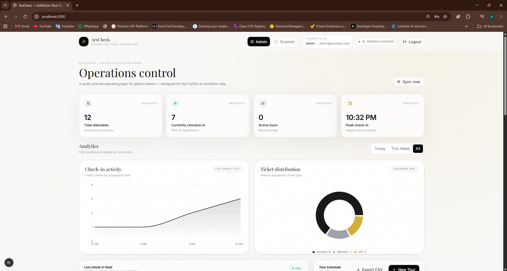
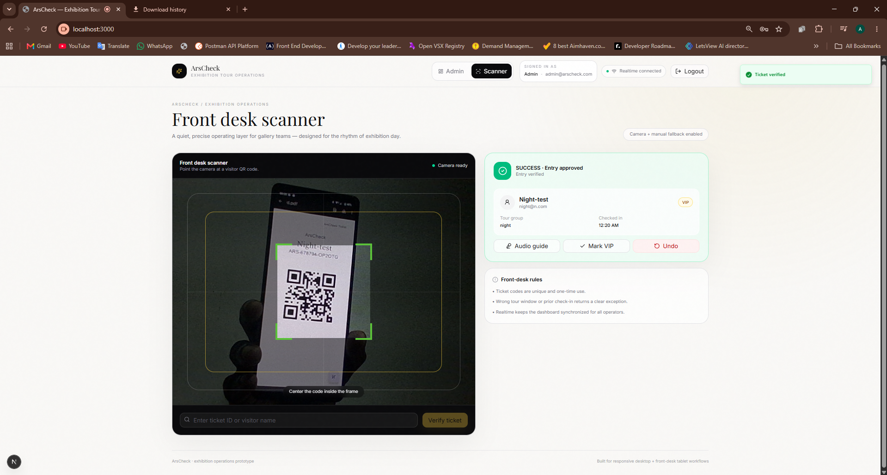
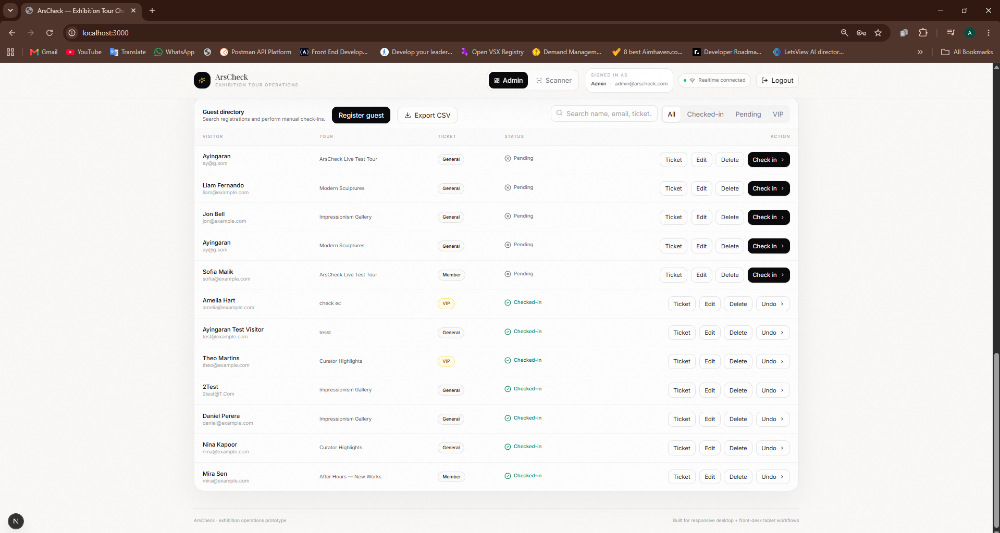
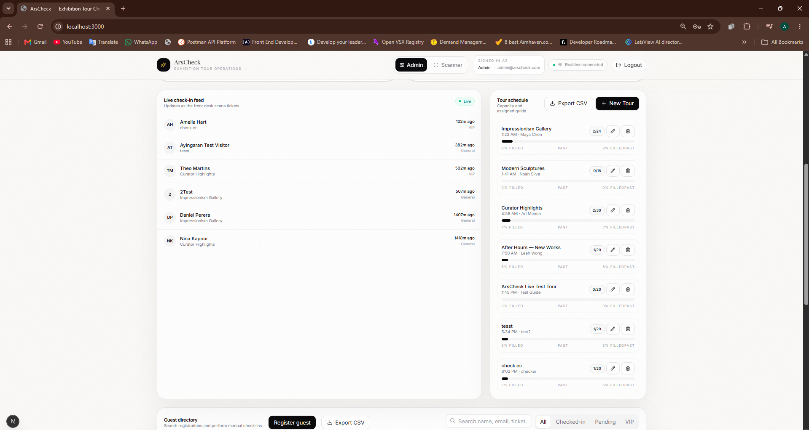
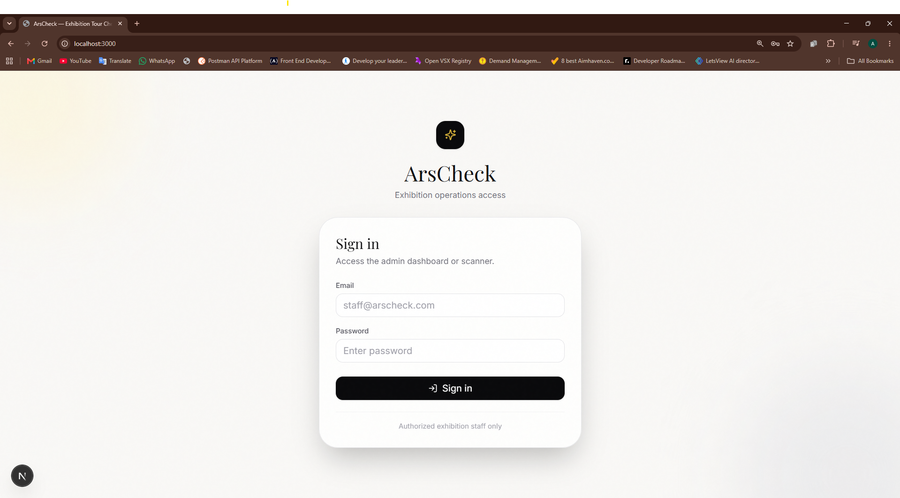

# ArsCheck

ArsCheck is a modern art exhibition tour check-in and visitor management system built with Next.js and Supabase.

It helps exhibition staff manage visitors, guided tours, ticket check-ins, QR scanning, live attendance updates, and operational analytics from a single dashboard.

## Live Demo

[Open ArsCheck](https://your-site-name.netlify.app)

> Replace the URL above with your actual Netlify deployment URL.

## Features

### Authentication & Role-Based Access

ArsCheck uses Supabase Authentication with role-based access control.

#### Admin

Admins can:

- View the operations dashboard
- Register visitors
- Edit visitor information
- Delete visitors
- Generate and print QR tickets
- Manually check visitors in and out
- Create tours
- Edit tours
- Delete tours
- View tour capacity
- Export visitor data to CSV
- Export tour data to CSV
- Access analytics
- Use the QR scanner

#### Staff

Staff members can:

- Access the QR scanner
- Scan visitor tickets
- Check visitors into valid tour sessions

Staff users cannot access administrative visitor or tour management features.

Users without an assigned `admin` or `staff` role are shown an Access Denied screen.

## Dashboard

The admin dashboard provides a live operational overview of the exhibition.

It includes:

- Total attendees
- Checked-in visitors
- Active tours
- Peak check-in time
- Tour schedules
- Tour capacity progress
- Guest directory
- Realtime attendance updates
- Check-in activity analytics
- Ticket type distribution

## Visitor Management

The Guest Directory allows administrators to manage exhibition attendees.

Available actions include:

- Register visitor
- Edit visitor
- Delete visitor
- View QR ticket
- Print QR ticket
- Manual check-in
- Undo check-in
- Search and filter visitors
- Export visitor records to CSV

## QR Ticket System

Each registered visitor receives a unique ArsCheck ticket code.

The ticket can be displayed as a QR code and printed for exhibition entry.

QR tickets include:

- Visitor name
- Ticket code
- Ticket type
- Assigned tour
- Tour time
- Check-in status

The scanner validates the ticket before allowing check-in.

## Tour Check-In Validation

Visitors can only check in during the permitted time window for their assigned tour.

Current check-in window:

```text
30 minutes before the tour
until
2 hours after the tour begins
```

ArsCheck detects:

- Invalid ticket codes
- Already checked-in visitors
- Incorrect tour timeslots
- Successful check-ins

## Tour Management

Admins can create and manage guided exhibition tours.

Each tour includes:

- Tour title
- Tour guide
- Start time
- Maximum capacity
- Exhibition assignment

Tour Schedule automatically displays tour status as:

```text
Active
Upcoming
Past
```

Active tours are prioritized first, followed by upcoming and past tours.

## Analytics

ArsCheck includes dashboard analytics powered by Recharts.

### Check-In Activity

Displays visitor check-ins grouped by time.

### Ticket Distribution

Displays the distribution of:

- General tickets
- VIP tickets
- Member tickets

Analytics can be filtered by:

```text
Today
This Week
All
```

## CSV Export

ArsCheck supports operational report exports directly from the dashboard.

### Visitor Export

Includes:

- Name
- Email
- Ticket code
- Ticket type
- Tour
- Check-in status
- Check-in timestamp

### Tour Export

Includes:

- Tour title
- Tour guide
- Start time
- Capacity
- Assigned visitors
- Checked-in visitors
- Exhibition

## Realtime Updates

Supabase Realtime is used to keep visitor information synchronized.

When visitor data changes, ArsCheck automatically refreshes relevant admin dashboard information without requiring a manual page reload.

## Tech Stack

### Frontend

- Next.js
- React
- TypeScript
- Tailwind CSS
- Framer Motion
- Lucide React
- Recharts

### Backend

- Next.js Route Handlers
- Supabase PostgreSQL
- Supabase Auth
- Supabase Realtime

### QR

- html5-qrcode
- qrcode.react

### Validation

- Zod

### Deployment

- GitHub
- Netlify
- Supabase

## Architecture

```text
User
 │
 ▼
Next.js Application
 │
 ├── Admin Dashboard
 ├── Staff Scanner
 ├── QR Ticket System
 └── Analytics
 │
 ▼
Next.js API Routes
 │
 ├── Authentication validation
 ├── Role authorization
 ├── Visitor management
 ├── Tour management
 └── Check-in validation
 │
 ▼
Supabase
 │
 ├── PostgreSQL Database
 ├── Authentication
 └── Realtime
```

## API Routes

ArsCheck includes the following server routes:

```text
POST   /api/check-in

GET    /api/dashboard-stats

POST   /api/tours

PATCH  /api/tours/[id]
DELETE /api/tours/[id]

POST   /api/visitors

PATCH  /api/visitors/[id]
DELETE /api/visitors/[id]
```

Administrative API routes require an authenticated user with the `admin` role.

The check-in API accepts authenticated users with either:

```text
admin
staff
```

## Security

ArsCheck uses server-side authorization to protect sensitive operations.

Supabase access tokens are sent with protected API requests.

The server verifies:

1. The user is authenticated
2. The Supabase access token is valid
3. The user has the required application role

Administrative database access is handled only on the server.

The following environment variable must never be exposed publicly:

```text
SUPABASE_SERVICE_ROLE_KEY
```

## Environment Variables

Create a file named:

```text
.env.local
```

Add:

```env
NEXT_PUBLIC_SUPABASE_URL=
NEXT_PUBLIC_SUPABASE_ANON_KEY=
SUPABASE_SERVICE_ROLE_KEY=
```

Never commit `.env.local` to GitHub.

## Local Development

Clone the repository:

```bash
git clone https://github.com/YOUR_USERNAME/arscheck.git
```

Enter the project:

```bash
cd arscheck
```

Install dependencies:

```bash
npm install
```

Create:

```text
.env.local
```

Add the required Supabase environment variables.

Start the development server:

```bash
npm run dev
```

Open:

```text
http://localhost:3000
```

## Production Build

Run:

```bash
npm run build
```

The application should complete:

```text
Compilation
TypeScript checking
Page generation
Production optimization
```

without errors.

## Deployment

ArsCheck is deployed using Netlify.

Deployment architecture:

```text
GitHub
   ↓
Netlify
   ↓
Next.js Application
   ↓
Supabase
```

The following environment variables must also be configured in Netlify:

```text
NEXT_PUBLIC_SUPABASE_URL
NEXT_PUBLIC_SUPABASE_ANON_KEY
SUPABASE_SERVICE_ROLE_KEY
```

## Screenshots

Create a folder in the repository:

```text
screenshots
```

Then add screenshots using names like:

```text
dashboard.png
scanner.png
visitors.png
tours.png
login.png
```

### Admin Dashboard



### QR Scanner



### Guest Directory



### Tour Management



### Login



## Project Highlights

ArsCheck demonstrates practical experience with:

- Full-stack Next.js development
- TypeScript
- REST-style API development
- PostgreSQL database integration
- Authentication
- Role-based access control
- Server-side authorization
- QR scanning
- Realtime systems
- Data visualization
- CSV reporting
- Responsive dashboard development
- Production deployment

## Future Improvements

Possible future improvements include:

- Exhibition CRUD management
- Staff/user management dashboard
- Advanced reporting
- Daily attendance summaries
- PDF ticket generation
- Email ticket delivery
- Audit logs
- Pagination for large visitor datasets
- More advanced tour capacity analytics
- Automated testing
- CI/CD improvements

## Author

**Ayingaran Arumugavel**

BSc (Hons) in Information Technology

Software Development · Quality Assurance · Cloud · DevOps

LinkedIn:  
https://linkedin.com/in/ayingaran17

## License

This project was developed as a portfolio and learning project.